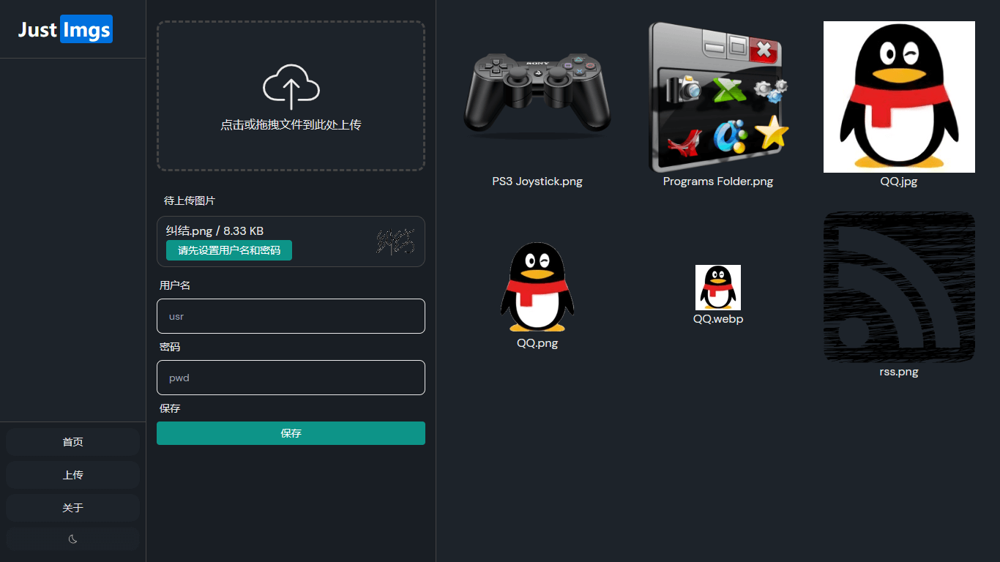
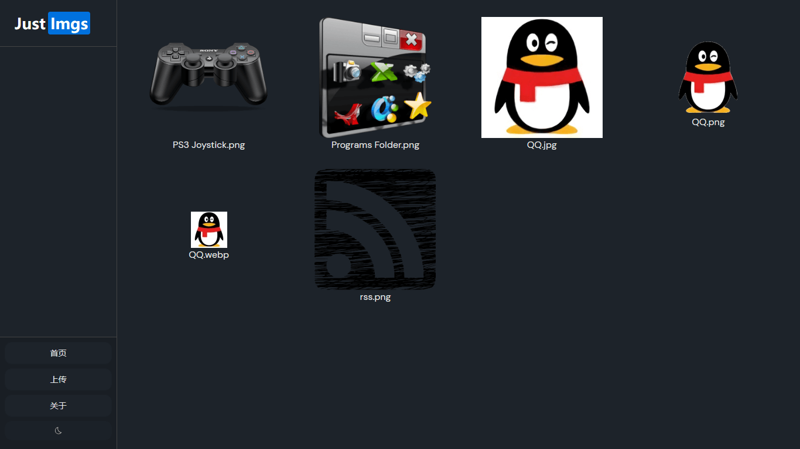

# Just-Imgs

图床管理前端，Vite + Vue3 + TS，对接 Cloudflare Worker + R2 使用；

对应的后端项目：[wdssmq/R2-Worker-cf](https://github.com/wdssmq/R2-Worker-cf "wdssmq/R2-Worker-cf")；

以及，终于实际用了下 [antfu/vitesse-lite](https://github.com/antfu/vitesse-lite "antfu/vitesse-lite")；

## 安装 / 调试 / 构建

- 执行 `install` 操作会自动生成 `.env.dev.local` 和 `.env.local`，分别用于本地调试和打包构建；
    - 修改其中的 `VITE_CF_WORKER_URL` 为正式或测试环境的 Cloudflare Worker 地址；
    - 参考：[环境变量和模式 | Vite 官方中文文档](https://cn.vitejs.dev/guide/env-and-mode.html "环境变量和模式 | Vite 官方中文文档")
- 下载 Worker 项目，设置相应的变量文件用于上传图片时的验证鉴权；
    - 调试运行时端口号会随机变更，需要修改至 vite 配置内；
- 用户名密码会保存在浏览器 localStorage 中；
- \--------------
- Worker 可以直接执行 `npm run deploy` 进行部署，前端这边可以打包后传 GitHub Pages 或者 Cloudflare Pages；
- 吐槽：见过几个项目带 `netlify.toml` 了，然而就没感觉没啥存在感；

## 截图

## 参考

lewkamtao/PicHub: 一个基于 Vue3 + TypeScript 实现的 Github 图床：

[https://github.com/lewkamtao/PicHub](https://github.com/lewkamtao/PicHub "lewkamtao/PicHub: 一个基于 Vue3 + TypeScript 实现的 Github 图床")

yusukebe/r2-image-worker: Store and Deliver images with R2 backend Cloudflare Workers.：

[https://github.com/yusukebe/r2-image-worker](https://github.com/yusukebe/r2-image-worker "yusukebe/r2-image-worker: Store and Deliver images with R2 backend Cloudflare Workers.")

## 投喂支持

爱发电：[https://afdian.net/a/wdssmq](https://afdian.net/a/wdssmq "沉冰浮水正在创作和 z-blog 相关或无关的各种有用或没用的代码 | 爱发电")

哔哩哔哩：[https://space.bilibili.com/44744006/video](https://space.bilibili.com/44744006/video "沉冰浮水的个人空间\_哔哩哔哩\_bilibili")「投币或充电」「[大会员卡券领取 - bilibili](https://account.bilibili.com/account/big/myPackage "大会员卡券领取 - bilibili")」

RSS 订阅：[https://feed.wdssmq.com/](https://feed.wdssmq.com/ "沉冰浮水博客的 RSS 订阅地址") 「[「言说」RSS 是一种态度！！](https://www.wdssmq.com/post/20201231613.html "「言说」RSS 是一种态度！！")」

在更多平台关注我：[https://www.wdssmq.com/guestbook.html#其他出没站点和信息](https://www.wdssmq.com/guestbook.html#%E5%85%B6%E4%BB%96%E5%87%BA%E6%B2%A1%E5%9C%B0%E7%82%B9%E5%92%8C%E4%BF%A1%E6%81%AF "在更多平台关注我")

更多「小代码」：[https://cn.bing.com/search?q=小代码+沉冰浮水](https://cn.bing.com/search?q=%E5%B0%8F%E4%BB%A3%E7%A0%81+%E6%B2%89%E5%86%B0%E6%B5%AE%E6%B0%B4 "小代码 沉冰浮水 - 必应搜索")

<!-- ##################################### -->
